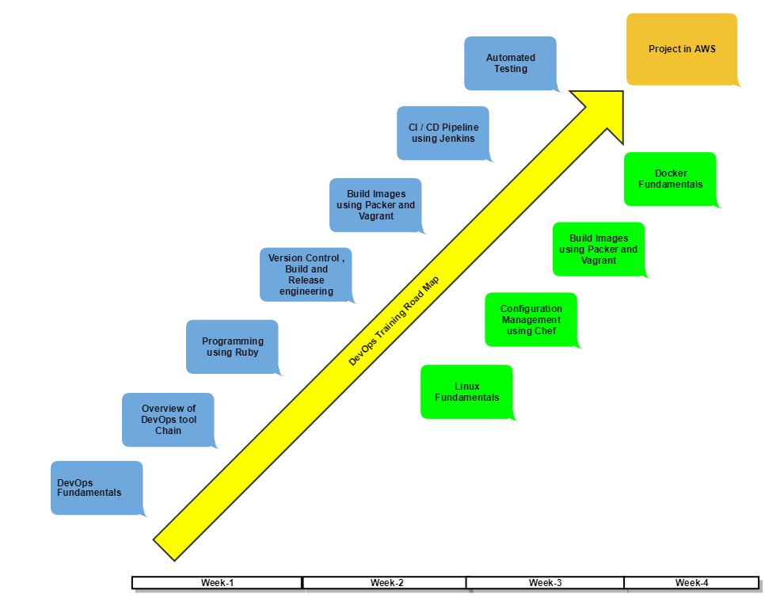

# DevOps Course Contents Listing

[Continous Integration Course Contents](./ContinousIntegration/README.md)

[Ruby Course Contents](./Ruby/README.md)

[Git Course Contents](./Git/README.md)

[Virtualbox Course Contents](./Virtualbox/README.md)

[Linux Course Contents](./Linux/README.md)

[Packer Course Contents](./Packer/README.md)

[Vagrant Course Contents](./Vagrant/README.md)

[Jenkins Course Contents](./Jenkins/README.md)

[Automated Testing Course Contents](./AutomatedTesting/README.md)

[Chef Course Contents](./Chef/README.md)

[Ansible Course Contents](./Ansible/README.md)

[Build Tools Course Contents](./BuildTools/README.md)

[Artifactory Course Contents](./Artifactory/README.md)

[Docker Course Contents](./Docker/README.md)

# DevOps Training Roadmap

